# Windows 환경에서 CentOS 7 (Rocky Linux) 설치

## Virtual Box 다운로드

자신의 host OS에 맞게 [VirtualBox 다운로드](https://www.virtualbox.org/wiki/Downloads)

23/09/10 기준으로 VirtualBox 7.0.10 버전 설치

## Virtual Box에 Rocky Linux 설치

CentOS 7 지원 종료 이슈 때문에 RHEL 9 사용하려 했으나, 다운로드가 수출 규정에 따라 보류됨

회사/조직 이름이나 하는 일 대충 적어서 그런 것 같음

따라서 Rocky Linux 설치

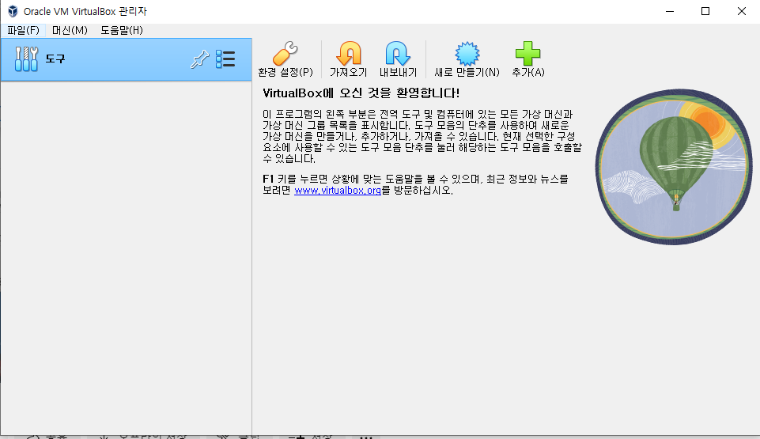

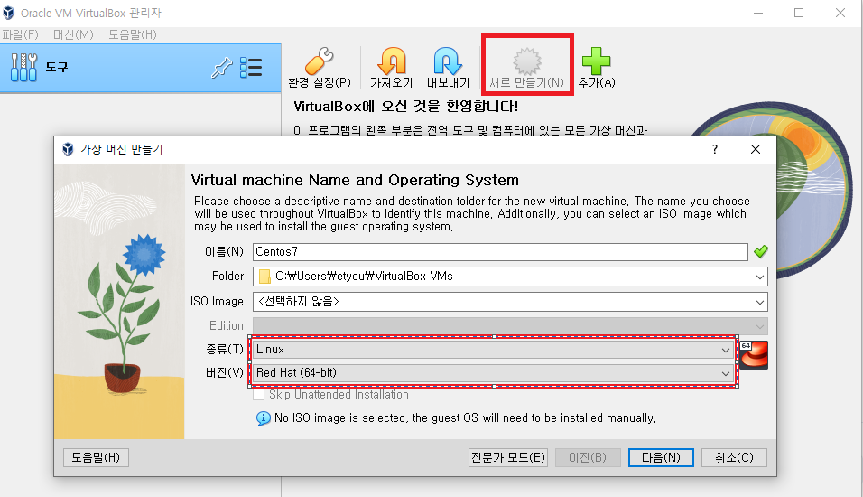

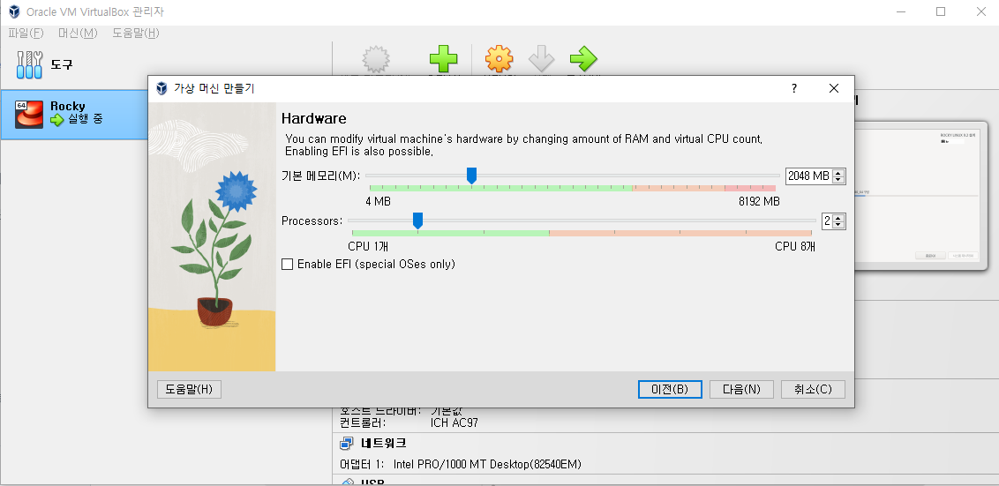

메모리 : 호스트 OS 사양에 따라 1~4 GB 설정 권장

CPU : 성능을 위해 2~4개 설정 권장

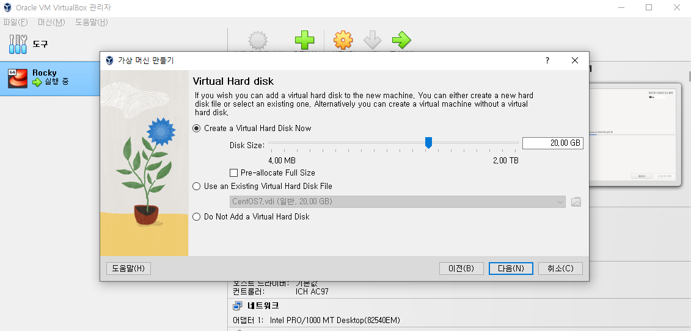

용량 : 넉넉하게 20GB 설정 (동적으로 용량할당/사용하지 않았던 공간은 호스트 pc에서 사용 가능)

이렇게 가상 머신 설정 완료

[Rocky Linux 홈페이지](https://rockylinux.org/ko/download)에서 아키텍쳐에 맞게 ISO 파일 다운로드 (윈도우는 x86_64)

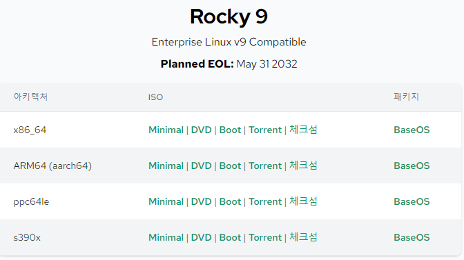

ISO 파일 설치 옵션
- Minimal : 쉘, 일부 유틸리티가 포함된 매우 기본적인 작업 시스템 설치됨 (GUI 포함 x)
- DVD : ISO에 모든 소프트웨어 포함됨 (GUI 포함 o)
- Boot : 시스템 복구를 위해 필요
- Torrent : 토렌트로 다운로드 (다운로드 속도를 위한 옵션)
- 체크섬 (설치옵션 x) : 보안을 위한 파일, 다운로드 받은 Rocky 9 파일이 변조되었는지 확인 가능

필요한 패키지 있으면 설치하면 되므로, minimal로 다운로드

해당 가상 머신 실행 시, 다음과 같은 이슈 발생

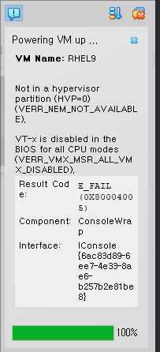

CPU에서 지원하는 가상화 기능이 꺼져있어서 발생

PC 다시시작 -> 바이오스 화면 진입 (Del 연타)

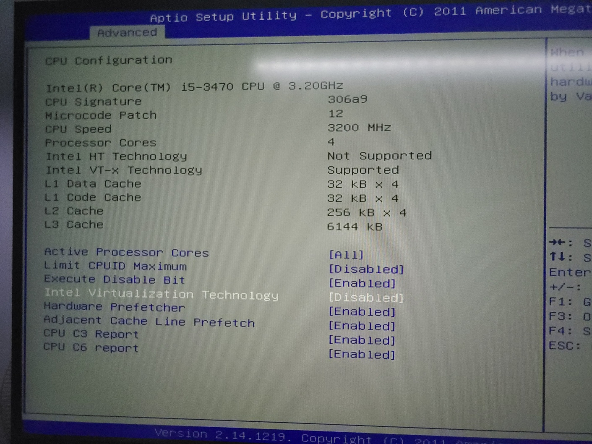

Virtualization (또는 SVM mode) Disable -> Enable

다시 가상 머신 실행

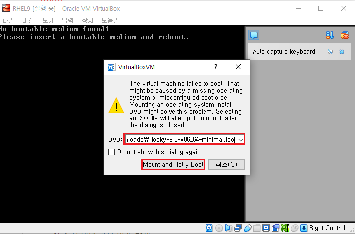

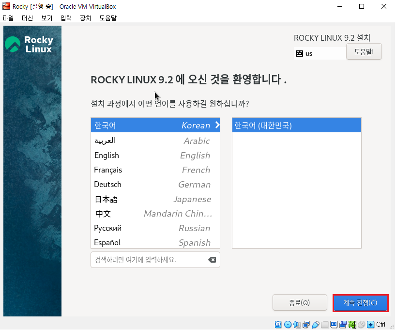

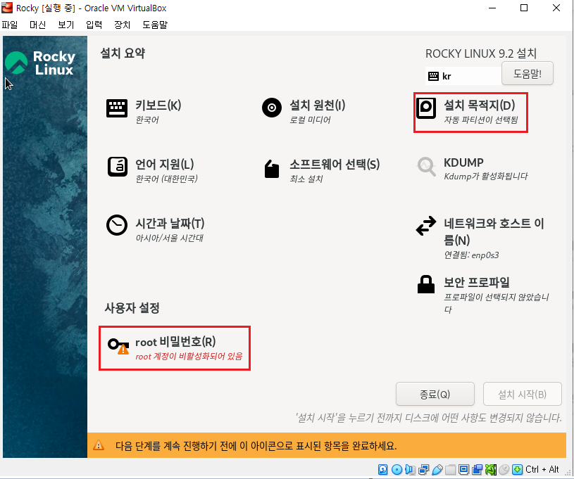

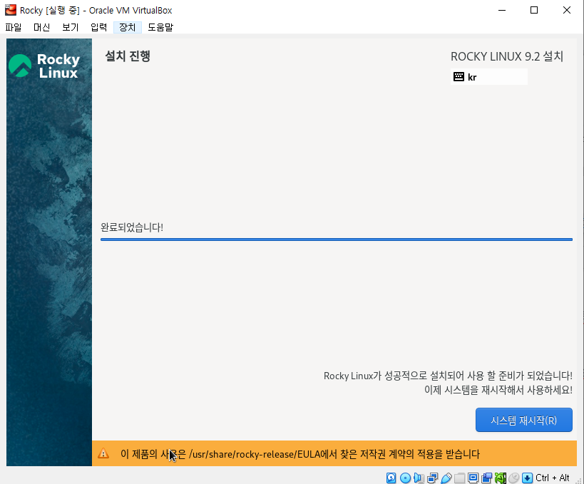

GRUB(GNU GRand Unified Bootloader) : 리눅스 운영체제의 부트 로더

부팅할 커널을 선택하는 구간

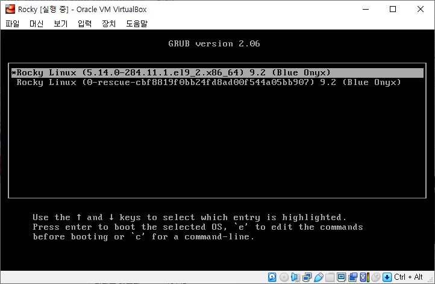

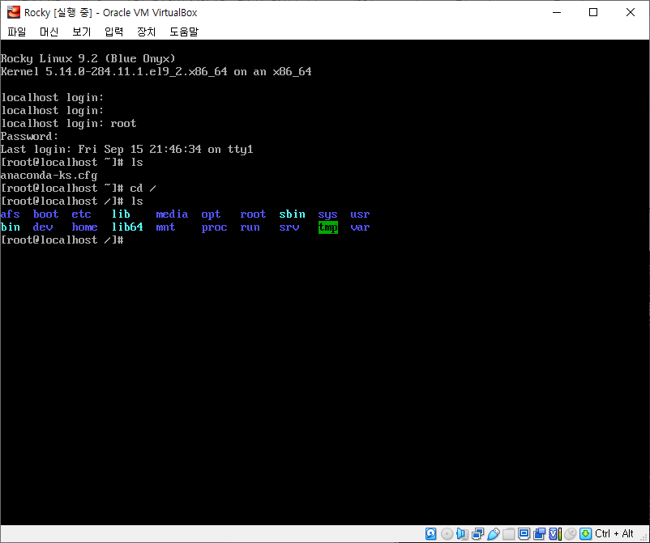

Minimal 옵션으로 Rocky Linux 다운받아서 별도의 GUI 가 없이 터미널만 제공됨

### 호스트 키 조합 설정

- 호스트 os로 돌아갈 때 사용하는 키
- 설정 안하면 ctrl+alt+del 로 작업관리자 들어가야 가상머신 벗어남..

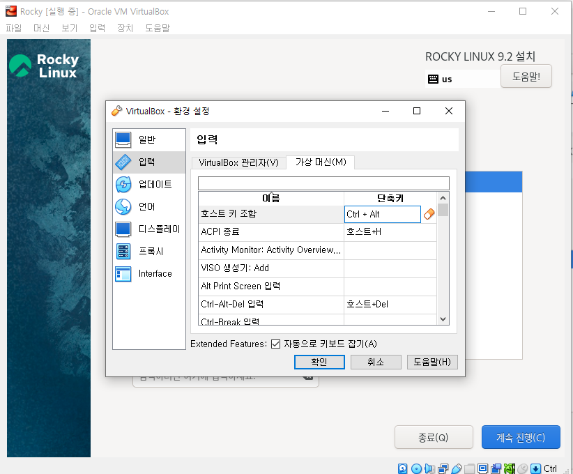
